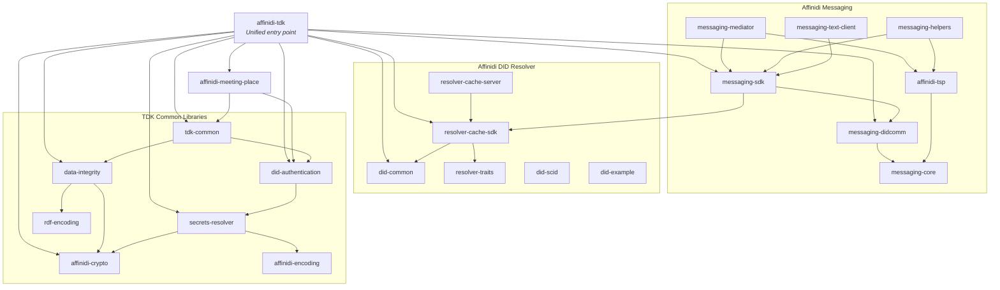

# Affinidi Trust Development Kit (TDK) for Rust

[](https://github.com/affinidi/affinidi-tdk-rs)
[](LICENSE)
[](https://github.com/affinidi/affinidi-tdk-rs/issues)

A Rust workspace for building secure, privacy-preserving applications using
decentralised identity technologies. The TDK provides libraries and tools for
DID resolution, DIDComm messaging, data integrity proofs, cryptographic
primitives, and more.

> **Disclaimer:** This project is provided "as is" without warranties or
> guarantees. By using this framework, users agree to assume all risks
> associated with its deployment and use, including implementing security and
> privacy measures in their applications. Affinidi assumes no liability for any
> issues arising from the use or modification of the project.

## Workspace Overview



## Crate Index

The workspace is organised into dependency layers under `crates/`: `core` →
`identity` → `credentials` / `protocols` / `messaging` → `trust` →
`applications`, with the `tdk` facade on top.

### [`affinidi-tdk`](./crates/tdk/affinidi-tdk/) — Unified Entry Point

A single crate that re-exports the TDK libraries behind feature flags so you can
depend on one crate and enable only what you need.

| Crate | Description |
|---|---|
| [`affinidi-tdk`](./crates/tdk/affinidi-tdk/) | Facade re-exporting the TDK behind capability features |
| [`affinidi-tdk-common`](./crates/tdk/affinidi-tdk-common/) | Shared structs, TLS config, and cross-crate utilities |

### [Core](./crates/core/)

Foundational primitives with no domain dependencies.

| Crate | Description |
|---|---|
| [`affinidi-crypto`](./crates/core/affinidi-crypto/) | Cryptographic primitives and JWK types — Ed25519, P-256, secp256k1 |
| [`affinidi-encoding`](./crates/core/affinidi-encoding/) | Multibase and multicodec encoding utilities |
| [`affinidi-cesr`](./crates/core/affinidi-cesr/) | CESR (Composable Event Streaming Representation) codec |
| [`affinidi-secrets-resolver`](./crates/core/affinidi-secrets-resolver/) | DID secret management and key resolution |
| [`affinidi-bbs`](./crates/core/affinidi-bbs/) | BBS Signatures (IETF draft) over BLS12-381 |
| [`affinidi-task-utils`](./crates/core/affinidi-task-utils/) | Background-task supervision with restart-on-failure and an observable health registry |

### [Identity & DID Resolution](./crates/identity/)

DID Document types and high-performance resolution with local and network caching (250k+ resolutions/sec cached).

| Crate | Description |
|---|---|
| [`affinidi-did-common`](./crates/identity/affinidi-did-common/) | DID Document types, builders, and common utilities |
| [`affinidi-did-resolver-cache-sdk`](./crates/identity/affinidi-did-resolver-cache-sdk/) | SDK for local and network DID resolution with caching |
| [`affinidi-did-resolver-cache-server`](./crates/identity/affinidi-did-resolver-cache-server/) | Standalone network DID resolution server |
| [`affinidi-did-resolver-traits`](./crates/identity/affinidi-did-resolver-traits/) | Pluggable resolver traits for custom DID methods |
| [`affinidi-did-authentication`](./crates/identity/affinidi-did-authentication/) | Authentication via proof of DID ownership |
| [`affinidi-did-web`](./crates/identity/did-methods/did-web/) | `did:web` DID method resolver |
| [`did-scid`](./crates/identity/did-methods/did-scid/) | `did:scid` Self-Certifying Identifier method |
| [`did-ebsi`](./crates/identity/did-methods/did-ebsi/) | `did:ebsi` method for legal entities |
| [`did-example`](./crates/identity/did-methods/did-example/) | `did:example` method for testing |

### [Credentials](./crates/credentials/)

W3C Verifiable Credentials and selective-disclosure formats.

| Crate | Description |
|---|---|
| [`affinidi-vc`](./crates/credentials/affinidi-vc/) | W3C Verifiable Credentials Data Model 1.1 and 2.0 |
| [`affinidi-sd-jwt`](./crates/credentials/affinidi-sd-jwt/) | SD-JWT (Selective Disclosure JWT) per IETF spec |
| [`affinidi-sd-jwt-vc`](./crates/credentials/affinidi-sd-jwt-vc/) | SD-JWT-based Verifiable Credentials (SD-JWT VC) |
| [`affinidi-data-integrity`](./crates/credentials/affinidi-data-integrity/) | W3C Data Integrity proofs (eddsa-jcs-2022, eddsa-rdfc-2022) |
| [`affinidi-rdf-encoding`](./crates/credentials/affinidi-rdf-encoding/) | RDFC-1.0 canonicalization and JSON-LD expansion |
| [`affinidi-status-list`](./crates/credentials/affinidi-status-list/) | Credential status and revocation lists (Bitstring Status List, eIDAS ASL/ARL) |
| [`affinidi-mdoc`](./crates/credentials/affinidi-mdoc/) | ISO/IEC 18013-5 mdoc (mobile driving licences, eIDAS attestations) |

### [Protocols](./crates/protocols/)

OpenID for Verifiable Credentials (OID4VC) protocol family.

| Crate | Description |
|---|---|
| [`affinidi-oid4vc-core`](./crates/protocols/affinidi-oid4vc-core/) | Shared types for the OID4VC protocol family |
| [`affinidi-siopv2`](./crates/protocols/affinidi-siopv2/) | Self-Issued OpenID Provider v2 (SIOPv2) |
| [`affinidi-openid4vci`](./crates/protocols/affinidi-openid4vci/) | OpenID for Verifiable Credential Issuance (OpenID4VCI) |
| [`affinidi-openid4vp`](./crates/protocols/affinidi-openid4vp/) | OpenID for Verifiable Presentations (OpenID4VP) |

### [Messaging](./crates/messaging/)

Secure, private messaging built on [DIDComm v2](https://identity.foundation/didcomm-messaging/spec/) and [TSP](https://trustoverip.github.io/tswg-tsp-specification/).

| Crate | Description |
|---|---|
| [`affinidi-messaging-sdk`](./crates/messaging/affinidi-messaging-sdk/) | SDK for integrating Affinidi Messaging into your application |
| [`affinidi-messaging-didcomm`](./crates/messaging/affinidi-messaging-didcomm/) | DIDComm v2.1 protocol implementation |
| [`affinidi-messaging-didcomm-service`](./crates/messaging/affinidi-messaging-didcomm-service/) | Always-online DIDComm client framework (connection, lifecycle, handler dispatch) |
| [`affinidi-messaging-core`](./crates/messaging/affinidi-messaging-core/) | Protocol-agnostic messaging traits |
| [`affinidi-messaging-mediator`](./crates/messaging/affinidi-messaging-mediator/) | Mediator & relay service (DIDComm and TSP via feature flags) |
| [`affinidi-messaging-test-mediator`](./crates/messaging/affinidi-messaging-test-mediator/) | Embedded mediator fixture for integration tests |
| [`affinidi-tsp`](./crates/messaging/affinidi-tsp/) | Trust Spanning Protocol (TSP) with HPKE-Auth encryption |

### [Trust](./crates/trust/)

| Crate | Description |
|---|---|
| [`affinidi-trust-lists`](./crates/trust/affinidi-trust-lists/) | EU Trusted Lists (ETSI TS 119 612) for eIDAS 2.0 trust infrastructure |

### [Applications](./crates/applications/)

| Crate | Description |
|---|---|
| [`affinidi-meeting-place`](./crates/applications/affinidi-meeting-place/) | Discover and connect with others using DIDs and DIDComm, securely and privately |

## Requirements

- **Rust** 1.90.0+ (2024 Edition)
- **Redis** 8.0+ (required for the messaging mediator)
- **Docker** (recommended for running Redis)

## Quick Start

Add the unified TDK crate to your project:

```toml
[dependencies]
affinidi-tdk = "0.5"
```

Or depend on individual crates for finer control:

```toml
[dependencies]
affinidi-did-resolver-cache-sdk = "0.8"
affinidi-messaging-sdk = "0.15"
affinidi-data-integrity = "0.4"
```

### Resolve a DID

```rust
use affinidi_did_resolver_cache_sdk::{config::ClientConfigBuilder, DIDCacheClient};

let config = ClientConfigBuilder::default().build();
let resolver = DIDCacheClient::new(config).await?;
let result = resolver.resolve("did:key:z6Mkr...").await?;
println!("DID Document: {:#?}", result.doc);
```

### Send a DIDComm Message

```rust
use affinidi_messaging_sdk::{ATM, config::Config};

let config = Config::builder()
    .with_my_did("did:peer:2...")
    .with_atm_did("did:peer:2...")
    .build()?;
let mut atm = ATM::new(config, vec![]).await?;
atm.send_ping("did:peer:2...", true, true).await?;
```

## Using affinidi-* crates from outside this workspace

This workspace's root `Cargo.toml` defines a non-trivial
[`[patch.crates-io]` table](./Cargo.toml#L85). Cargo's patch tables
are only honoured by the workspace that *defines* them — when an
external repository depends on any affinidi-* crate via a git rev or
local path, that consumer must replicate the same patch table
verbatim, or different parts of the dependency closure will end up
resolving the affinidi-* crates from a mix of crates.io and the
git/path source. Type-graph divergence shows up as confusing trait
mismatches at compile time (`expected MediatorACLSet, found
MediatorACLSet`).

This is a known cargo limitation — see
[rust-lang/cargo#4452](https://github.com/rust-lang/cargo/issues/4452).

### Recommended path: depend on crates.io releases

The simplest approach is to depend on published versions only:

```toml
[dependencies]
affinidi-tdk = "0.7"
affinidi-messaging-sdk = "0.17"

[dev-dependencies]
affinidi-messaging-test-mediator = "0.1"
```

No patch table is needed — cargo resolves a single version of each
affinidi-* crate from crates.io and the type graph is unified by
construction.

### When you must use a git rev (unreleased fixes)

If you need a patch that hasn't reached crates.io yet, pin the
relevant affinidi-* crates to the same git rev, *and* mirror the
workspace's patch table so transitive deps go through the same rev:

```toml
[patch.crates-io]
# Pick a single rev that all affinidi-* deps resolve through.
# Bump this when you bump any affinidi-* dep above.
affinidi-secrets-resolver = { git = "https://github.com/affinidi/affinidi-tdk-rs", rev = "<rev>" }
affinidi-did-resolver-cache-sdk = { git = "https://github.com/affinidi/affinidi-tdk-rs", rev = "<rev>" }
affinidi-did-common = { git = "https://github.com/affinidi/affinidi-tdk-rs", rev = "<rev>" }
affinidi-crypto = { git = "https://github.com/affinidi/affinidi-tdk-rs", rev = "<rev>" }
affinidi-encoding = { git = "https://github.com/affinidi/affinidi-tdk-rs", rev = "<rev>" }
affinidi-data-integrity = { git = "https://github.com/affinidi/affinidi-tdk-rs", rev = "<rev>" }
affinidi-messaging-didcomm = { git = "https://github.com/affinidi/affinidi-tdk-rs", rev = "<rev>" }
affinidi-messaging-sdk = { git = "https://github.com/affinidi/affinidi-tdk-rs", rev = "<rev>" }
affinidi-messaging-mediator = { git = "https://github.com/affinidi/affinidi-tdk-rs", rev = "<rev>" }
affinidi-messaging-mediator-common = { git = "https://github.com/affinidi/affinidi-tdk-rs", rev = "<rev>" }
affinidi-did-authentication = { git = "https://github.com/affinidi/affinidi-tdk-rs", rev = "<rev>" }
affinidi-tdk-common = { git = "https://github.com/affinidi/affinidi-tdk-rs", rev = "<rev>" }
affinidi-tdk = { git = "https://github.com/affinidi/affinidi-tdk-rs", rev = "<rev>" }
affinidi-meeting-place = { git = "https://github.com/affinidi/affinidi-tdk-rs", rev = "<rev>" }
affinidi-tsp = { git = "https://github.com/affinidi/affinidi-tdk-rs", rev = "<rev>" }
affinidi-did-web = { git = "https://github.com/affinidi/affinidi-tdk-rs", rev = "<rev>" }
did-scid = { git = "https://github.com/affinidi/affinidi-tdk-rs", rev = "<rev>" }
```

The rev must match — and stay matched — to the version constraints
in your own `[dependencies]`. If you bump `affinidi-tdk` above, bump
the rev too; otherwise cargo may fall back to crates.io for crates
not in the patch table.

A regenerator helper is provided to emit the patch block for a
specific commit on this repo:

```bash
./tools/generate-consumer-patch.sh <git-rev>
```

## Support & Feedback

If you face any issues or have suggestions, please don't hesitate to contact us
using [this link](https://share.hsforms.com/1i-4HKZRXSsmENzXtPdIG4g8oa2v).

### Reporting Technical Issues

If you have a technical issue, you can
[open an issue](https://github.com/affinidi/affinidi-tdk-rs/issues/new) directly
in GitHub. Please include a **title and clear description**, as much relevant
information as possible, and a **code sample** or **executable test case**
demonstrating the expected behaviour.

## Contributing

Want to contribute? Head over to our
[CONTRIBUTING](https://github.com/affinidi/affinidi-tdk-rs/blob/main/CONTRIBUTING.md)
guidelines.

## License

This project is licensed under the [Apache-2.0](LICENSE) license.
