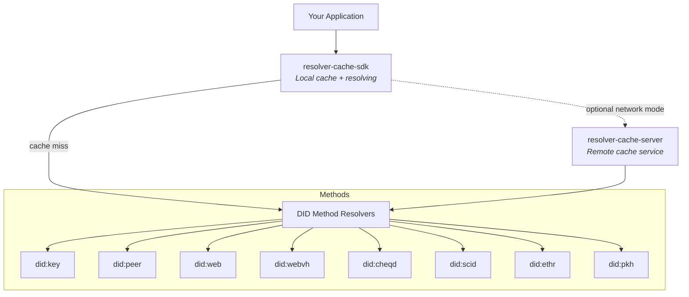

# Affinidi DID Resolver

[](https://github.com/affinidi/affinidi-tdk-rs/tree/main/crates/affinidi-did-resolver)
[](https://github.com/affinidi/affinidi-tdk-rs/blob/main/LICENSE)

High-performance [Decentralised Identifier (DID)](https://www.w3.org/TR/did-1.0/)
resolution with local and network caching. Exceeds **250k resolutions/sec** in
full cache mode, and **500k+ resolutions/sec** for computational DIDs like
`did:key`.

> **Disclaimer:** This project is provided "as is" without warranties or
> guarantees. Users assume all risks associated with its deployment and use.

## Architecture



## Crates

| Crate | Description |
|---|---|
| [`affinidi-did-resolver-cache-sdk`](./affinidi-did-resolver-cache-sdk/) | SDK for local and network DID resolution with caching |
| [`affinidi-did-resolver-cache-server`](./affinidi-did-resolver-cache-server/) | Standalone network resolution server |
| [`affinidi-did-common`](./affinidi-did-common/) | DID Document types, builders, and common utilities |
| [`affinidi-did-resolver-traits`](./affinidi-did-resolver-traits/) | Pluggable traits for custom DID method resolvers |
| [`did-scid`](./affinidi-did-resolver-methods/did-scid/) | Self-Certifying Identifier DID method |
| [`did-example`](./affinidi-did-resolver-methods/did-example/) | Example DID method for testing |

## Quick Start

### Resolve DIDs locally (default)

```rust
use affinidi_did_resolver_cache_sdk::{config::ClientConfigBuilder, DIDCacheClient};

let config = ClientConfigBuilder::default().build();
let resolver = DIDCacheClient::new(config).await?;

let result = resolver.resolve("did:key:z6Mkr...").await?;
println!("Document: {:#?}", result.doc);
```

### Resolve DIDs via a network server

Enable the `network` feature and point to a running cache server:

```rust
let config = ClientConfigBuilder::default()
    .with_network_mode("ws://127.0.0.1:8080/did/v1/ws")
    .build();
let resolver = DIDCacheClient::new(config).await?;
```

### Run the cache server

```bash
cd affinidi-did-resolver-cache-server
cargo run
```

## Supported DID Methods

| Method | Default | Feature Flag |
|---|---|---|
| `did:key` | Yes | — |
| `did:peer` | Yes | — |
| `did:web` | Yes | — |
| `did:ethr` | Yes | — |
| `did:pkh` | Yes | — |
| `did:webvh` | Yes | `did-methods` |
| `did:cheqd` | Yes | `did-methods` |
| `did:scid` | Yes | `did-methods` |
| `did:example` | No | `did_example` |

## Related Crates

- [`affinidi-tdk`](../affinidi-tdk/) — Unified TDK entry point
- [`affinidi-messaging`](../affinidi-messaging/) — DIDComm messaging (depends on this resolver)
- [`affinidi-crypto`](../affinidi-tdk/common/affinidi-crypto/) — Cryptographic primitives

## License

[Apache-2.0](https://github.com/affinidi/affinidi-tdk-rs/blob/main/LICENSE)
