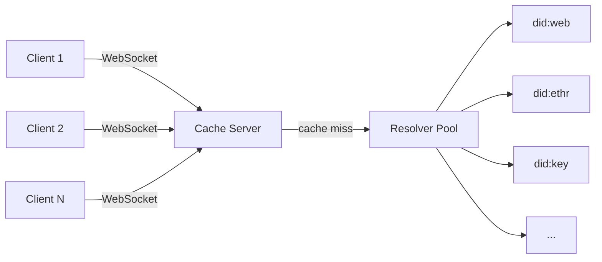

# affinidi-did-resolver-cache-server

[](https://crates.io/crates/affinidi-did-resolver-cache-server)
[](https://docs.rs/affinidi-did-resolver-cache-server)
[](https://github.com/affinidi/affinidi-tdk-rs/tree/main/crates/affinidi-did-resolver/affinidi-did-resolver-cache-server)
[](https://github.com/affinidi/affinidi-tdk-rs/blob/main/LICENSE)

A standalone network service for resolving and caching DID Documents at scale.
Uses WebSockets for transport and operates a service-wide cache backed by a pool
of parallel resolvers.

## Architecture



Requests from clients can be multiplexed and may be responded to out of order.
The client SDK handles matching results to requests.

## Running

1. Configure via `./conf/cache-conf.toml` or environment variables.
2. Start the server:

```bash
cargo run
```

## Related Crates

- [`affinidi-did-resolver-cache-sdk`](../affinidi-did-resolver-cache-sdk/) — Client SDK (use `network` feature to connect)
- [`affinidi-did-common`](../affinidi-did-common/) — DID Document types (dependency)

## License

[Apache-2.0](https://github.com/affinidi/affinidi-tdk-rs/blob/main/LICENSE)
