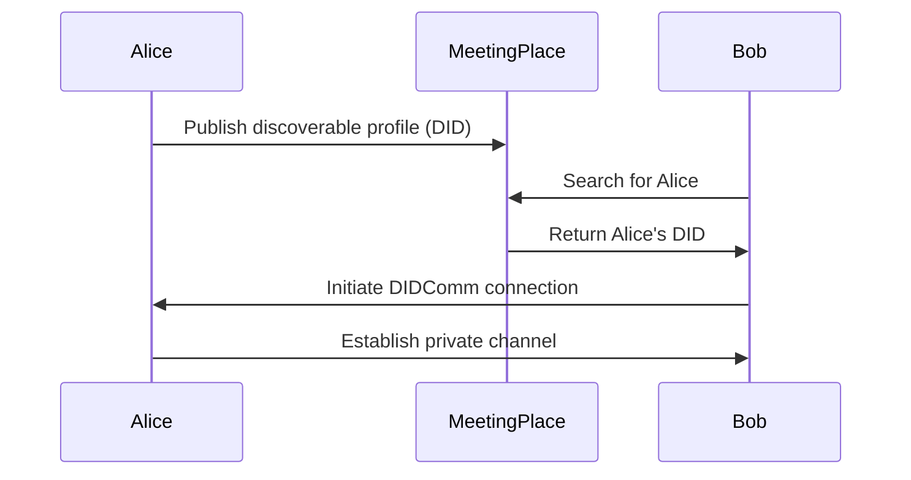

# affinidi-meeting-place

[](https://crates.io/crates/affinidi-meeting-place)
[](https://docs.rs/affinidi-meeting-place)
[](https://github.com/affinidi/affinidi-tdk-rs/tree/main/crates/affinidi-meeting-place)
[](https://github.com/affinidi/affinidi-tdk-rs/blob/main/LICENSE)

SDK for [Affinidi Meeting Place](https://meetingplace.world) — discover and
connect with others in a secure and private way using
[Decentralised Identifiers (DIDs)](https://www.w3.org/TR/did-1.0/) and the
[DIDComm](https://identity.foundation/didcomm-messaging/spec/) protocol.

## How It Works



## Installation

```toml
[dependencies]
affinidi-meeting-place = "0.3"
```

## Related Crates

- [`affinidi-did-authentication`](../affinidi-tdk/common/affinidi-did-authentication/) — DID authentication (dependency)
- [`affinidi-tdk-common`](../affinidi-tdk/common/affinidi-tdk-common/) — Shared utilities (dependency)
- [`affinidi-messaging`](../affinidi-messaging/) — DIDComm messaging framework
- [`affinidi-did-resolver`](../affinidi-did-resolver/) — DID resolution

## License

[Apache-2.0](https://github.com/affinidi/affinidi-tdk-rs/blob/main/LICENSE)
