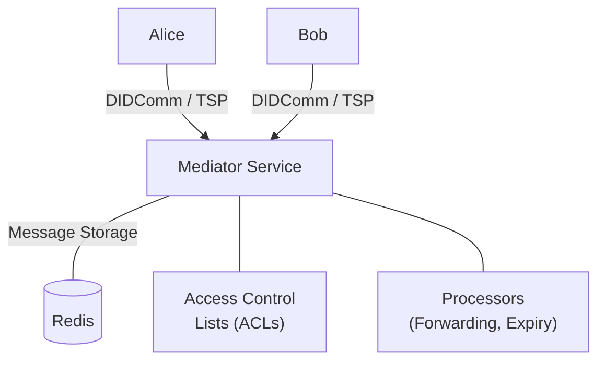

# affinidi-messaging-mediator

[](https://github.com/affinidi/affinidi-tdk-rs/tree/main/crates/affinidi-messaging/affinidi-messaging-mediator)
[](https://github.com/affinidi/affinidi-tdk-rs/blob/main/LICENSE)

A mediator and relay service supporting
[DIDComm v2](https://identity.foundation/didcomm-messaging/spec/) and
[Trust Spanning Protocol (TSP)](https://trustoverip.github.io/tswg-tsp-specification/).
Handles connections, permissions, and message routing between messaging
participants.

## Feature Flags

Protocol support is controlled via Cargo feature flags. At least one must be
enabled.

| Feature | Default | Description |
|---|---|---|
| `didcomm` | Yes | DIDComm v2 protocol support (authentication, inbound/outbound, OOB discovery) |
| `tsp` | No | Trust Spanning Protocol support |

```bash
# DIDComm only (default)
cargo build

# TSP only
cargo build --no-default-features --features tsp

# Both protocols
cargo build --features "didcomm,tsp"
```

## Architecture



## Prerequisites

- Rust 1.90.0+ (2024 Edition)
- Docker (for Redis)
- Redis 8.0+

## Running the Mediator

### 1. Start Redis

```bash
docker run --name=redis-local --publish=6379:6379 --hostname=redis \
  --restart=on-failure --detach redis:latest
```

### 2. Configure the Environment

Run from the `affinidi-messaging` directory:

```bash
cargo run --bin setup_environment
```

This generates:
- Mediator DID and secrets
- Administration DID and secrets
- SSL certificates for local development
- Optionally, test user DIDs

### 3. Start the Mediator

```bash
cd affinidi-messaging-mediator
export REDIS_URL=redis://@localhost:6379
cargo run
```

## Access Control Lists (ACLs)

The mediator provides granular access control at both the mediator and DID level.

### Mediator-level ACLs

| Flag | Description |
|---|---|
| `explicit_allow` | Deny all DIDs except those explicitly allowed |
| `explicit_deny` | Allow all DIDs unless explicitly denied |
| `local_direct_delivery_allowed` | Allow direct messaging to local DIDs |

### DID-level ACLs

| Flag | Description |
|---|---|
| `ALLOW_ALL` | Allow all operations (default) |
| `DENY_ALL` | Deny all operations |
| `LOCAL` | Store messages for this DID |
| `SEND_MESSAGES` | DID can send messages |
| `RECEIVE_MESSAGES` | DID can receive messages |
| `SEND_FORWARDED` | DID can send forwarded messages |
| `RECEIVE_FORWARDED` | DID can receive forwarded messages |
| `ANON_RECEIVE` | DID can receive anonymous messages |
| `CREATE_INVITES` | DID can create OOB invites |

Self-change flags (e.g., `SEND_MESSAGES_CHANGE`, `SELF_MANAGE_LIST`) allow users
to update their own ACLs when permitted by the administrator.

## Operating Modes

| Mode | Mediator ACL | DID ACL | Direct Delivery | Use Case |
|---|---|---|---|---|
| **Private Closed** | `explicit_allow` | `DENY_ALL + LOCAL + SEND + RECEIVE` | Yes | Restricted corporate network |
| **Private Open** | `explicit_allow` | `ALLOW_ALL` | Yes | Internal company messaging |
| **Public Closed** | `explicit_deny` | `ALLOW_ALL + MODE_EXPLICIT_ALLOW` | No | Consent-based messaging |
| **Public Open** | `explicit_deny` | `ALLOW_ALL` | No | Unrestricted relay |
| **Public Mixed** | `explicit_deny` | `ALLOW_ALL + MODE_EXPLICIT_ALLOW` | No | Discovery + private channels |

See the `mediator.toml` configuration file for details on each mode.

## Sub-crates

| Crate | Description |
|---|---|
| [`affinidi-messaging-mediator-processors`](./affinidi-messaging-mediator-processors/) | Scalable parallel processors (message expiry, forwarding) |
| `affinidi-messaging-mediator-common` | Shared types for the mediator |

## Examples

Ensure the mediator is running, then:

```bash
# Mediator administration
cargo run --bin mediator_administration
```

See [affinidi-messaging-helpers](../affinidi-messaging-helpers/) for additional
examples.

## Related Crates

- [`affinidi-messaging-sdk`](../affinidi-messaging-sdk/) — Client SDK
- [`affinidi-messaging-didcomm`](../affinidi-messaging-didcomm/) — DIDComm protocol
- [`affinidi-tsp`](../affinidi-tsp/) — Trust Spanning Protocol
- [`affinidi-messaging-core`](../affinidi-messaging-core/) — Protocol-agnostic messaging traits
- [`affinidi-did-resolver`](../../affinidi-did-resolver/) — DID resolution

## License

[Apache-2.0](https://github.com/affinidi/affinidi-tdk-rs/blob/main/LICENSE)
