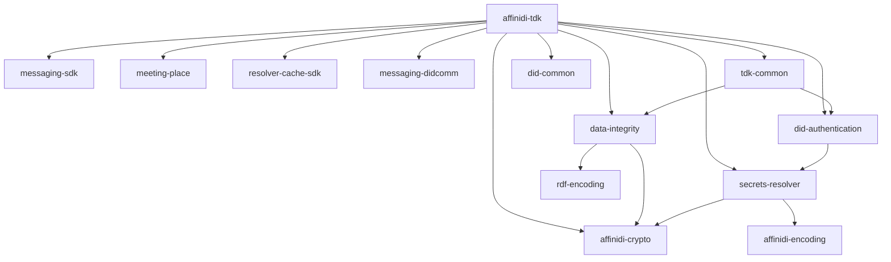

# Affinidi Trust Development Kit (TDK)

The Affinidi TDK provides common libraries for building privacy-preserving
services using decentralised identity technologies. This directory contains the
unified `affinidi-tdk` crate and shared common libraries.

> **Disclaimer:** This project is provided "as is" without warranties or
> guarantees. Users assume all risks associated with its deployment and use.

## Crates

### [`affinidi-tdk`](./affinidi-tdk/) — Unified Entry Point

A single dependency that re-exports the core TDK libraries. Use feature flags to
include only what you need.

### Common Libraries

| Crate | Description |
|---|---|
| [`affinidi-crypto`](./common/affinidi-crypto/) | Cryptographic primitives — key generation, JWK, Ed25519, P-256, P-384, secp256k1 |
| [`affinidi-encoding`](./common/affinidi-encoding/) | Multibase and multicodec encoding utilities |
| [`affinidi-secrets-resolver`](./common/affinidi-secrets-resolver/) | DID secret management and key resolution |
| [`affinidi-did-authentication`](./common/affinidi-did-authentication/) | Authentication via DID ownership proofs |
| [`affinidi-tdk-common`](./common/affinidi-tdk-common/) | Shared structs, TLS config, and cross-crate utilities |
| [`affinidi-data-integrity`](./common/affinidi-data-integrity/) | W3C Data Integrity proofs (eddsa-jcs-2022, eddsa-rdfc-2022) |
| [`affinidi-rdf-encoding`](./common/affinidi-rdf-encoding/) | RDFC-1.0 canonicalization and JSON-LD expansion |

## Dependency Graph

## Related Crates

- [`affinidi-messaging`](../affinidi-messaging/) — DIDComm messaging framework
- [`affinidi-did-resolver`](../affinidi-did-resolver/) — DID resolution and caching
- [`affinidi-meeting-place`](../affinidi-meeting-place/) — Secure discovery and connection

## License

[Apache-2.0](https://github.com/affinidi/affinidi-tdk-rs/blob/main/LICENSE)
