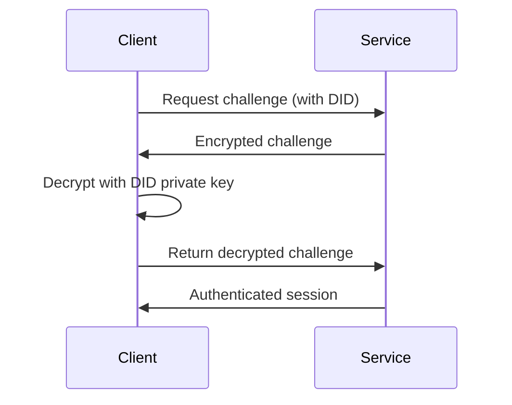

# affinidi-did-authentication

[](https://crates.io/crates/affinidi-did-authentication)
[](https://docs.rs/affinidi-did-authentication)
[](https://github.com/affinidi/affinidi-tdk-rs/tree/main/crates/affinidi-tdk/common/affinidi-did-authentication)
[](https://github.com/affinidi/affinidi-tdk-rs/blob/main/LICENSE)

Authentication using proof of DID ownership. A client proves it controls a DID
by encrypting a server-issued challenge with the DID's private keys, enabling
service-level authentication and authorisation without passwords.

## How It Works



## Installation

```toml
[dependencies]
affinidi-did-authentication = "0.3"
```

## Usage

### As a library

Integrate DID authentication into your Rust services by using the library API.

### As a binary

A test binary is available in the
[`affinidi-tdk`](../../affinidi-tdk/) crate:

```bash
# Using an environment profile
cargo run -- -a did:web:meetingplace.world environment -n Alice

# Manually providing a DID (pass secrets via STDIN)
cargo run -- -a did:web:example.com manual -d did:peer:2...
```

## Related Crates

- [`affinidi-secrets-resolver`](../affinidi-secrets-resolver/) — Secret management (dependency)
- [`affinidi-did-resolver-cache-sdk`](../../../affinidi-did-resolver/affinidi-did-resolver-cache-sdk/) — DID resolution (dependency)
- [`affinidi-tdk-common`](../affinidi-tdk-common/) — Shared TDK utilities

## License

[Apache-2.0](https://github.com/affinidi/affinidi-tdk-rs/blob/main/LICENSE)
