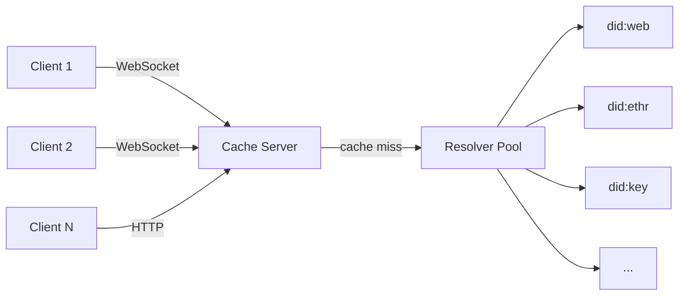

# affinidi-did-resolver-cache-server

[](https://crates.io/crates/affinidi-did-resolver-cache-server)
[](https://docs.rs/affinidi-did-resolver-cache-server)
[](https://github.com/affinidi/affinidi-tdk-rs/tree/main/crates/identity/affinidi-did-resolver-cache-server)
[](https://github.com/affinidi/affinidi-tdk-rs/blob/main/LICENSE)

A standalone network service for resolving and caching DID Documents at scale.
Exposes both a WebSocket endpoint (multiplexed, out-of-order responses) and an
HTTP endpoint (request–response), backed by a process-wide cache and a pool of
parallel resolvers.

## Architecture



WebSocket clients multiplex multiple in-flight requests on one connection and
may receive responses out of order. The
[`affinidi-did-resolver-cache-sdk`](../affinidi-did-resolver-cache-sdk/) handles
the matching on the client side.

## Running

```bash
# Run with the config file at the default path (./conf/cache-conf.toml)
cargo run --release

# Run with a custom config path (useful when the binary and config live in
# different directories, e.g. /usr/local/bin + /etc/affinidi/)
cargo run --release -- --config /etc/affinidi/cache-conf.toml
# or, short form:
cargo run --release -- -c /etc/affinidi/cache-conf.toml

# Installed binary
affinidi-did-resolver-cache-server -c /etc/affinidi/cache-conf.toml
```

Any configuration value can also be overridden via environment variables
referenced from `cache-conf.toml` (see the default config for the full list).

## Feature flags

| Feature | Default | Effect |
|---|:---:|---|
| `network` | ✅ | Registers the `/did/v1/ws` WebSocket endpoint that the client SDK's `network` mode connects to. Forwards to `affinidi-did-resolver-cache-sdk/network`, which pulls rustls + WebSocket wiring. |

The HTTP resolver endpoint (`/did/v1/resolve/{did}`) and the health endpoints
are always compiled in — they do not depend on the `network` feature.

```bash
# Full build (WebSocket + HTTP + health)
cargo build -p affinidi-did-resolver-cache-server

# Equivalent: explicitly enable `network`
cargo build -p affinidi-did-resolver-cache-server --features network

# HTTP-only build (no /ws, no WebSocket dependencies)
# If `enable_websocket_endpoint` is still true in cache-conf.toml the server
# logs a notice at startup and skips /ws instead of failing to start.
cargo build -p affinidi-did-resolver-cache-server --no-default-features
```

The DID methods the server resolves (did:web, did:webvh, did:cheqd, did:scid,
did:ethr, did:pkh, did:jwk, did:ebsi, did:key, did:peer) are configured via
the `affinidi-did-resolver-cache-sdk` dependency's own feature flags. If you
need a different method mix, edit the SDK's default feature set at
`affinidi-did-resolver-cache-sdk/Cargo.toml`.

## Related Crates

- [`affinidi-did-resolver-cache-sdk`](../affinidi-did-resolver-cache-sdk/) — client SDK (enable the `network` feature to connect over WebSocket)
- [`affinidi-did-common`](../affinidi-did-common/) — DID / DID Document types

## License

[Apache-2.0](https://github.com/affinidi/affinidi-tdk-rs/blob/main/LICENSE)
