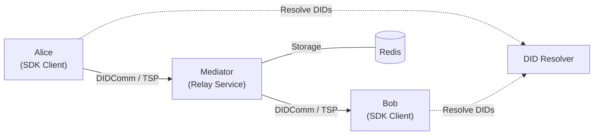

# Affinidi Messaging

[](https://github.com/affinidi/affinidi-tdk-rs/tree/main/crates/affinidi-messaging)
[](https://github.com/affinidi/affinidi-tdk-rs/blob/main/LICENSE)

Secure, private, and trusted messaging built on the
[DIDComm v2](https://identity.foundation/didcomm-messaging/spec/) and
[Trust Spanning Protocol (TSP)](https://trustoverip.github.io/tswg-tsp-specification/)
protocols. Affinidi Messaging leverages
[Decentralised Identifiers (DIDs)](https://www.w3.org/TR/did-1.0/) to provide
end-to-end encrypted, authenticated digital communication.

> **Disclaimer:** This project is provided "as is" without warranties or
> guarantees. Users assume all risks associated with its deployment and use.

## Architecture



Messages are end-to-end encrypted using the recipient's DID public keys. The
mediator routes and stores messages but **cannot** read their content.

## Crates

| Crate | Description |
|---|---|
| [`affinidi-messaging-sdk`](./affinidi-messaging-sdk/) | SDK for integrating messaging into your application |
| [`affinidi-messaging-didcomm`](./affinidi-messaging-didcomm/) | DIDComm v2.1 protocol implementation |
| [`affinidi-messaging-core`](./affinidi-messaging-core/) | Protocol-agnostic messaging traits |
| [`affinidi-messaging-mediator`](./affinidi-messaging-mediator/) | Mediator & relay service (DIDComm and TSP support via feature flags) |
| [`affinidi-messaging-didcomm-service`](./affinidi-messaging-didcomm-service/) | Framework for building always-online DIDComm services with mediator connectivity, message routing, middleware, and handler dispatch |
| [`affinidi-messaging-helpers`](./affinidi-messaging-helpers/) | Setup tools, environment config, and example runners |
| [`affinidi-tsp`](./affinidi-tsp/) | Trust Spanning Protocol implementation (HPKE-Auth, CESR) |
| [`affinidi-messaging-text-client`](./affinidi-messaging-text-client/) | Terminal-based DIDComm chat client |

**Dependencies:**
[affinidi-did-resolver](../affinidi-did-resolver/) for DID Document resolution.

## Getting Started

### Prerequisites

- Rust 1.90.0+ (2024 Edition)
- Docker (for Redis)
- Redis 8.0+

### 1. Start the storage backend

For Redis-backed deployments (the default; required for
multi-mediator clusters):

```bash
docker run --name=redis-local --publish=6379:6379 --hostname=redis \
  --restart=on-failure --detach redis:latest
```

For single-node deployments you can skip this step and pick the
embedded **Fjall** backend in the wizard's Database step — Fjall
stores its data in a local directory and needs no sidecar.

### 2. Configure the Mediator

Run the interactive setup wizard:

```bash
cargo run --bin mediator-setup
```

The wizard generates the mediator DID and secrets, the admin
credential, optional self-signed SSL certificates, and a
ready-to-run `mediator.toml`. See the mediator's
[setup guide](./affinidi-messaging-mediator/docs/setup-guide.md)
for the full operator walkthrough including online VTA, sealed-mint,
and sealed-export flows.

### 3. Start the Mediator

The wizard prints the exact build/run commands for your chosen
features when it finishes. The default DIDComm + Redis build is:

```bash
cargo run --release -p affinidi-messaging-mediator -- \
  -c conf/mediator.toml
```

### 4. Run Examples

Go to [affinidi-messaging-helpers](./affinidi-messaging-helpers/) to explore
available examples including trust pings, sending/receiving messages, and message
pickup. Examples expect a hand-written `environments.json` — the helpers
crate's README documents the schema.

## Related Crates

- [`affinidi-did-resolver`](../affinidi-did-resolver/) — DID resolution and caching
- [`affinidi-tdk`](../affinidi-tdk/) — Unified TDK entry point
- [`affinidi-meeting-place`](../affinidi-meeting-place/) — Secure discovery and connection
- [`affinidi-cesr`](../affinidi-tdk/common/affinidi-cesr/) — CESR codec used by TSP

## License

[Apache-2.0](https://github.com/affinidi/affinidi-tdk-rs/blob/main/LICENSE)
