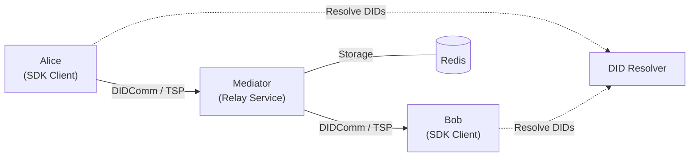

# Affinidi Messaging

Secure, private, and trusted messaging built on the
[DIDComm v2](https://identity.foundation/didcomm-messaging/spec/) and
[Trust Spanning Protocol (TSP)](https://trustoverip.github.io/tswg-tsp-specification/)
protocols. Affinidi Messaging leverages
[Decentralised Identifiers (DIDs)](https://www.w3.org/TR/did-1.0/) to provide
end-to-end encrypted, authenticated digital communication.

> **Disclaimer:** This project is provided "as is" without warranties or
> guarantees. Users assume all risks associated with its deployment and use.

## Architecture

```mermaid
graph LR
    A["Alice<br/>(SDK Client)"] -->|DIDComm / TSP| M["Mediator<br/>(Relay Service)"]
    M -->|DIDComm / TSP| B["Bob<br/>(SDK Client)"]
    M ---|Storage| R[(Redis)]
    A -.->|Resolve DIDs| DR["DID Resolver"]
    B -.->|Resolve DIDs| DR
```

Messages are end-to-end encrypted using the recipient's DID public keys. The
mediator routes and stores messages but **cannot** read their content.

## Crates

| Crate | Description |
|---|---|
| [`affinidi-messaging-sdk`](./affinidi-messaging-sdk/) | SDK for integrating messaging into your application |
| [`affinidi-messaging-didcomm`](./affinidi-messaging-didcomm/) | DIDComm v2.1 protocol implementation |
| [`affinidi-messaging-core`](./affinidi-messaging-core/) | Protocol-agnostic messaging traits |
| [`affinidi-messaging-didcomm-service`](./affinidi-messaging-didcomm-service/) | Framework for building always-online DIDComm services with mediator connectivity, message routing, middleware, and handler dispatch |
| [`affinidi-messaging-helpers`](./affinidi-messaging-helpers/) | Setup tools, environment config, and example runners |
| [`affinidi-tsp`](./affinidi-tsp/) | Trust Spanning Protocol implementation (HPKE-Base, CESR) |
| [`affinidi-messaging-text-client`](./affinidi-messaging-text-client/) | Terminal-based DIDComm chat client |
| [`affinidi-messaging-mediator-types`](./affinidi-messaging-mediator-types/) | Protocol types shared by the mediator and its clients (ACLs, problem reports, pickup envelopes) |

The mediator itself — `affinidi-messaging-mediator`, `-mediator-common`, the
`affinidi-messaging-test-mediator` fixture, and the `mediator-console`
(`-mediator-tui` / `-mediator-admin`) — lives in its own repository,
[affinidi/affinidi-messaging-mediator](https://github.com/affinidi/affinidi-messaging-mediator).

**Dependencies:**
[affinidi-did-resolver](../affinidi-did-resolver/) for DID Document resolution.

## Getting Started

### Prerequisites

- Rust 1.90.0+ (2024 Edition)
- A running mediator. To run your own, follow the setup guide in
  [affinidi/affinidi-messaging-mediator](https://github.com/affinidi/affinidi-messaging-mediator) — its
  `mediator-setup` wizard generates the mediator DID, secrets, admin
  credential and a ready-to-run `mediator.toml`.

### Run Examples

Go to [affinidi-messaging-helpers](./affinidi-messaging-helpers/) to explore
available examples including trust pings, sending/receiving messages, and message
pickup. Examples expect a hand-written `environments.json` — the helpers
crate's README documents the schema.

## Operating a mediator

`mediator-console`, the terminal console for a running mediator, ships with the
mediator in [affinidi/affinidi-messaging-mediator](https://github.com/affinidi/affinidi-messaging-mediator).

## Related Crates

- [`affinidi-did-resolver`](../affinidi-did-resolver/) — DID resolution and caching
- [`affinidi-tdk`](../affinidi-tdk/) — Unified TDK entry point
- [`affinidi-meeting-place`](../affinidi-meeting-place/) — Secure discovery and connection
- [`affinidi-cesr`](../affinidi-tdk/common/affinidi-cesr/) — CESR codec used by TSP

## License

[Apache-2.0](https://github.com/affinidi/affinidi-tdk-rs/blob/main/LICENSE)
