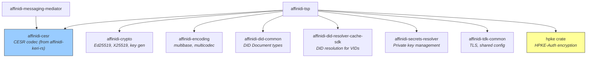
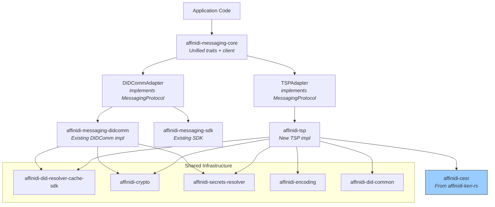
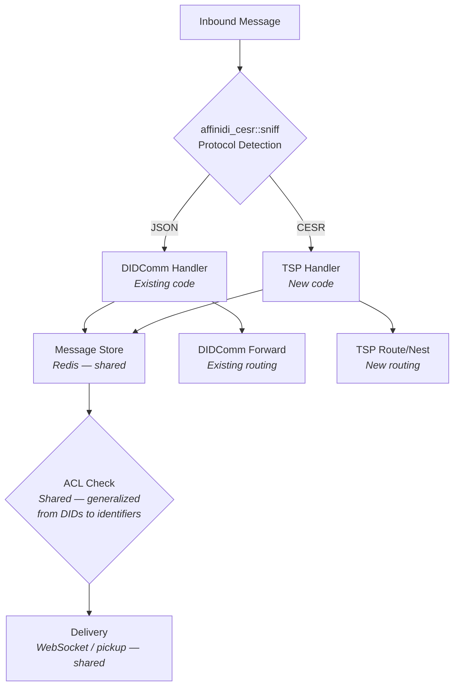

# Proposal: TSP Integration & Unified Messaging Abstraction

## Executive Summary

This proposal outlines how to:
1. Implement the Trust Spanning Protocol (TSP) reusing Affinidi TDK and KERI libraries
2. Create a trait-based messaging abstraction that lets applications use either
   DIDComm or TSP through a single API

---

## Part 1: Protocol Comparison

### Concept Mapping

| Concept | DIDComm v2.1 | TSP |
|---|---|---|
| **Identity** | DID | VID (Verifiable Identifier) — superset of DIDs |
| **Identity Document** | DID Document | VID resolution (maps to keys + endpoints) |
| **Encryption** | JWE (ECDH-1PU authcrypt, ECDH-ES anoncrypt) | HPKE-Auth (seal/open) |
| **Signing** | JWS (Ed25519, P-256) | Ed25519 outer signature |
| **Encoding** | JSON (JWM) | CESR (binary/text) |
| **Relay** | Mediator (forward messages) | Intermediary (routed messages) |
| **Privacy** | Routing through mediators | Nested + routed modes |
| **Relationship** | Implicit (just send) | Explicit (RFI → RFA handshake) |
| **Key Agreement** | DID Doc `keyAgreement` | VID encryption key resolution |
| **Secret Management** | Secrets Resolver | PrivateVid trait |
| **Transport** | Transport-agnostic | Transport-agnostic |
| **Content Type** | JSON body + attachments | Opaque byte payload |

### Key Architectural Differences

```mermaid
graph TD
    subgraph DIDComm["DIDComm v2.1"]
        DC_MSG["JSON Message (JWM)"] --> DC_SIGN["JWS Signing"]
        DC_SIGN --> DC_ENC["JWE Encryption<br/>ECDH-1PU / ECDH-ES"]
        DC_ENC --> DC_FWD["Forward Wrapping<br/>(per mediator hop)"]
        DC_FWD --> DC_TRANSPORT["Transport"]
    end

    subgraph TSP["Trust Spanning Protocol"]
        TSP_PAY["Payload (bytes)"] --> TSP_SEAL["HPKE-Auth Seal<br/>(encrypt + authenticate)"]
        TSP_SEAL --> TSP_SIGN["Ed25519 Outer Signature"]
        TSP_SIGN --> TSP_CESR["CESR Encoding"]
        TSP_CESR --> TSP_NEST["Optional: Nest / Route"]
        TSP_NEST --> TSP_TRANSPORT["Transport"]
    end
```



**DIDComm**: Sign-then-encrypt, JSON-based, mediator routing via forward messages,
relationship is implicit in message exchange.

**TSP**: Encrypt-then-sign (seal+sign), CESR-encoded, nested/routed modes for
privacy, explicit relationship lifecycle (RFI/RFA/RFD control messages).

---

## Part 2: Affinidi TSP Implementation

### Reuse Analysis

| Affinidi Crate | Source | TSP Reuse | Notes |
|---|---|---|---|
| `affinidi-cesr` | `affinidi-keri-rs` | **Direct** | Full CESR codec — Matter, Counter, Indexer, stream sniffing |
| `affinidi-crypto` | `affinidi-tdk-rs` | **Direct** | Ed25519 signing, X25519 key exchange, key generation |
| `affinidi-encoding` | `affinidi-tdk-rs` | **Direct** | Multibase/multicodec for key encoding in VIDs |
| `affinidi-did-common` | `affinidi-tdk-rs` | **Direct** | DID Document types — TSP VIDs can be DIDs |
| `affinidi-did-resolver-cache-sdk` | `affinidi-tdk-rs` | **Direct** | Resolve DID-based VIDs (did:key, did:peer, did:web, did:webvh) |
| `affinidi-did-resolver-traits` | `affinidi-tdk-rs` | **Extend** | Add `VidResolver` trait that wraps `AsyncResolver` |
| `affinidi-secrets-resolver` | `affinidi-tdk-rs` | **Direct** | Private key storage maps to TSP's `PrivateVid` concept |
| `affinidi-did-authentication` | `affinidi-tdk-rs` | **Adapt** | Challenge-response maps to TSP relationship forming |
| `affinidi-tdk-common` | `affinidi-tdk-rs` | **Direct** | TLS config, shared utilities |
| `affinidi-data-integrity` | `affinidi-tdk-rs` | **Indirect** | Useful if TSP payloads carry VCs |

### `affinidi-cesr` — Already Built

The `affinidi-cesr` crate in the `affinidi-keri-rs` workspace provides a
complete CESR implementation that directly supports TSP message encoding:

| Component | What It Provides | TSP Usage |
|---|---|---|
| **`Matter`** | CESR primitives (code + raw bytes) with qb64/qb2 encode/decode | Encode/decode Ed25519 keys (`B`, `D`), X25519 keys (`C`), signatures (`0B`), digests (`E`, `F`, `I`), variable-length data (`4A`, `4B`) |
| **`Counter`** | Group framing codes (`-A`, `-B`, etc.) with count values | Frame attached material groups in TSP messages |
| **`Indexer`** | Indexed signature codes with index/ondex for key rotation | Indexed signatures in TSP signed messages |
| **`codec`** | Base64url encode/decode, qb64↔qb2 conversion, lead byte calculation | Low-level encoding for all CESR operations |
| **`sniff`** | Stream format detection (JSON, CBOR, MessagePack, CESR text/binary) | **Protocol detection in the mediator** — distinguish DIDComm (JSON) from TSP (CESR) |
| **`tables`** | Sizage lookups, hardage, code tables for matter/counter/indexer | Code validation and size calculation |

The `sniff` module is particularly valuable for the unified mediator — it
already distinguishes JSON (DIDComm) from CESR (TSP) by inspecting the first
byte:

```rust
// From affinidi-cesr/src/sniff.rs — already implemented
match data[0] {
    b'{' => StreamFormat::Json,                    // DIDComm message
    b'A'..=b'Z' | b'a'..=b'z' | ... => CesrText,  // TSP message
    _ => CesrBinary,                                // TSP binary
}
```

**Dependencies**: Only `base64ct` and `thiserror` — extremely lightweight.

### Proposed Crate: `affinidi-tsp`

New crate implementing the TSP protocol, structured to maximise reuse. The CESR
encoding layer is fully handled by `affinidi-cesr` — `affinidi-tsp` builds TSP
message structures from its primitives.

```
crates/affinidi-tsp/
├── Cargo.toml
├── src/
│   ├── lib.rs              # Public API
│   ├── vid/
│   │   ├── mod.rs           # VID types wrapping affinidi-did-common
│   │   ├── resolution.rs    # VID resolution via affinidi-did-resolver
│   │   └── verification.rs  # VID verification
│   ├── crypto/
│   │   ├── mod.rs           # Crypto operations
│   │   ├── hpke.rs          # HPKE-Auth seal/open (new)
│   │   └── signing.rs       # Ed25519 signing (wraps affinidi-crypto)
│   ├── messages/
│   │   ├── mod.rs           # TSP message types
│   │   ├── envelope.rs      # TSP envelope (sender VID + receiver VID as Matter)
│   │   ├── control.rs       # RFI, RFA, RFD control messages
│   │   ├── direct.rs        # Direct mode messaging
│   │   ├── nested.rs        # Nested mode
│   │   └── routed.rs        # Routed mode
│   ├── store/
│   │   ├── mod.rs           # VID + relationship store
│   │   └── relationships.rs # Relationship state machine
│   └── transport/
│       └── mod.rs           # Transport dispatch
```

### Dependency Map



**Legend**: Blue = existing Affinidi crate from another workspace. Yellow = new
external dependency.

### How TSP Messages Use `affinidi-cesr`

TSP messages are composed from CESR primitives:

```rust
use affinidi_cesr::{Matter, Counter, Indexer};

// TSP Envelope: sender VID + receiver VID encoded as variable-length Matter
let sender_vid = Matter::new("4B", sender_vid_bytes)?;   // variable-length bytes
let receiver_vid = Matter::new("4B", receiver_vid_bytes)?;

// TSP Signature: Ed25519 signature as an Indexer
let signature = Indexer::new("A", 0, None, sig_bytes)?;

// Group framing
let sig_counter = Counter::new("-B", 1)?;  // 1 attached signature

// Compose the full message in qb64
let message = format!(
    "{}{}{}{}{}",
    envelope_matter.qb64()?,
    ciphertext_matter.qb64()?,
    sig_counter.qb64()?,
    signature.qb64()?,
    // ... additional attached material
);
```

### What's New vs Reused

| Component | Implementation |
|---|---|
| **CESR codec** | **Reuse `affinidi-cesr`** from `affinidi-keri-rs` |
| **CESR stream detection** | **Reuse `affinidi-cesr::sniff`** — mediator protocol detection |
| **TSP message framing** | New — compose Matter/Counter/Indexer into TSP envelope+payload+signature |
| **HPKE-Auth seal/open** | New — DIDComm uses ECDH-1PU/JWE, TSP uses HPKE |
| **Ed25519 signing** | Reuse `affinidi-crypto` |
| **X25519 key exchange** | Reuse `affinidi-crypto` |
| **Key generation** | Reuse `affinidi-crypto` |
| **Key encoding** | Reuse `affinidi-encoding` |
| **DID Document types** | Reuse `affinidi-did-common` |
| **DID resolution** | Reuse `affinidi-did-resolver-cache-sdk` |
| **Private key storage** | Reuse `affinidi-secrets-resolver` |
| **VID types** | Thin wrapper over `affinidi-did-common::Document` |
| **Relationship state** | New — TSP has explicit relationship lifecycle |
| **Control messages** | New — RFI/RFA/RFD |
| **Nested/routed modes** | New — recursive message wrapping |
| **Transport dispatch** | Partially reuse patterns from messaging SDK |

### Sharing `affinidi-cesr` Across Workspaces

The `affinidi-cesr` crate currently lives in `affinidi-keri-rs`. To use it from
`affinidi-tdk-rs`, several options:

1. **Publish to crates.io** (recommended) — Makes it available to both
   workspaces and external consumers. It has minimal dependencies (`base64ct`,
   `thiserror`) so it's a clean standalone crate.

2. **Git dependency** — Reference `affinidi-keri-rs` as a git dependency:
   ```toml
   affinidi-cesr = { git = "https://github.com/affinidi/affinidi-keri-rs", version = "0.1" }
   ```

3. **Move to a shared location** — Extract `affinidi-cesr` into its own
   repository or into `affinidi-tdk-rs` as a shared primitive.

Option 1 is recommended since CESR is a general-purpose encoding used by both
KERI and TSP, and the crate is self-contained.

### Suggested Changes to Existing Crates

1. **`affinidi-crypto`** — Add an HPKE module (or keep it in `affinidi-tsp` if
   you prefer to keep `affinidi-crypto` minimal). TSP needs HPKE-Auth which is
   fundamentally different from the ECDH-1PU used by DIDComm.

2. **`affinidi-did-resolver-traits`** — The existing `AsyncResolver` trait
   returns `Option<Result<Document, ResolverError>>`. This already works for TSP
   since VIDs that are DIDs resolve to DID Documents. No change needed, but a
   convenience wrapper trait `VidResolver` could make the TSP API cleaner:

   ```rust
   /// Resolves a VID to its public keys and endpoint.
   /// Delegates to AsyncResolver for DID-based VIDs.
   pub trait VidResolver: Send + Sync {
       async fn resolve_vid(&self, vid: &str) -> Result<ResolvedVid, VidError>;
   }
   ```

3. **`affinidi-secrets-resolver`** — The existing `Secret` type and resolution
   logic maps well to TSP's `PrivateVid` concept. Consider adding a trait:

   ```rust
   pub trait PrivateKeyProvider: Send + Sync {
       fn signing_key(&self, vid: &str) -> Option<&[u8]>;
       fn decryption_key(&self, vid: &str) -> Option<&[u8]>;
   }
   ```

---

## Part 3: Unified Messaging Abstraction

### Design Principles

1. **Protocol-agnostic API** — Application code should not know whether it's
   using DIDComm or TSP
2. **Zero-cost when using one protocol** — Feature-gated to avoid pulling in
   unused dependencies
3. **Shared transport layer** — Both protocols can use the same WebSocket/HTTP
   infrastructure
4. **Per-connection protocol selection** — Different connections can use
   different protocols simultaneously

### Core Traits

```rust
// crates/affinidi-messaging/affinidi-messaging-core/src/traits.rs

use std::fmt::Debug;

/// A verifiable identifier — DID for DIDComm, VID for TSP.
pub trait VerifiableId: Clone + Send + Sync + Debug {
    /// String representation of the identifier.
    fn as_str(&self) -> &str;

    /// Validate the identifier format.
    fn validate(&self) -> Result<(), IdentifierError>;
}

/// Resolved identity with public keys and endpoints.
pub trait ResolvedIdentity: Send + Sync {
    /// Signing/verification public key.
    fn verification_key(&self) -> &[u8];

    /// Encryption public key.
    fn encryption_key(&self) -> &[u8];

    /// Service endpoint URL(s) for message delivery.
    fn endpoints(&self) -> &[url::Url];
}

/// A message that can be sent through the messaging layer.
pub trait Message: Send + Sync {
    /// Unique message identifier.
    fn id(&self) -> &str;

    /// Sender identifier (if authenticated).
    fn sender(&self) -> Option<&str>;

    /// Recipient identifier.
    fn recipient(&self) -> &str;

    /// Message payload as bytes.
    fn payload(&self) -> &[u8];

    /// Protocol-specific metadata.
    fn metadata(&self) -> &dyn std::any::Any;
}

/// Result of unpacking/decrypting a received message.
pub struct ReceivedMessage {
    pub id: String,
    pub sender: Option<String>,
    pub recipient: String,
    pub payload: Vec<u8>,
    pub protocol: Protocol,
    pub verified: bool,
    pub encrypted: bool,
}

/// Which protocol was used.
#[derive(Debug, Clone, Copy, PartialEq, Eq)]
pub enum Protocol {
    DIDComm,
    TSP,
}

/// Core messaging operations — implemented by DIDComm and TSP adapters.
#[async_trait::async_trait]
pub trait MessagingProtocol: Send + Sync {
    /// Which protocol this implements.
    fn protocol(&self) -> Protocol;

    /// Pack a message for a recipient (encrypt + sign).
    async fn pack(
        &self,
        payload: &[u8],
        sender: &str,
        recipient: &str,
        sign: bool,
    ) -> Result<Vec<u8>, MessagingError>;

    /// Pack a message for a recipient anonymously (encrypt only, no sender).
    async fn pack_anonymous(
        &self,
        payload: &[u8],
        recipient: &str,
    ) -> Result<Vec<u8>, MessagingError>;

    /// Unpack a received message (decrypt + verify).
    async fn unpack(
        &self,
        packed: &[u8],
    ) -> Result<ReceivedMessage, MessagingError>;

    /// Wrap a packed message for relay/routing through an intermediary.
    async fn wrap_for_relay(
        &self,
        packed: &[u8],
        next_hop: &str,
        final_recipient: &str,
    ) -> Result<Vec<u8>, MessagingError>;
}

/// Identity resolution — resolve an identifier to keys and endpoints.
#[async_trait::async_trait]
pub trait IdentityResolver: Send + Sync {
    async fn resolve(
        &self,
        id: &str,
    ) -> Result<Box<dyn ResolvedIdentity>, MessagingError>;
}

/// Relationship management — explicit in TSP, implicit in DIDComm.
#[async_trait::async_trait]
pub trait RelationshipManager: Send + Sync {
    /// Request a relationship with another party.
    /// DIDComm: no-op (relationships are implicit).
    /// TSP: sends RFI control message.
    async fn request_relationship(
        &self,
        my_id: &str,
        their_id: &str,
    ) -> Result<RelationshipState, MessagingError>;

    /// Accept an incoming relationship request.
    async fn accept_relationship(
        &self,
        my_id: &str,
        their_id: &str,
        request_digest: &[u8],
    ) -> Result<RelationshipState, MessagingError>;

    /// Query the state of a relationship.
    async fn relationship_state(
        &self,
        my_id: &str,
        their_id: &str,
    ) -> Result<RelationshipState, MessagingError>;
}

#[derive(Debug, Clone, PartialEq, Eq)]
pub enum RelationshipState {
    /// No relationship exists.
    None,
    /// We have sent a request, awaiting acceptance.
    Pending,
    /// One-way verified relationship.
    Unidirectional,
    /// Mutually verified relationship.
    Bidirectional,
}

/// Transport — send and receive raw packed messages.
#[async_trait::async_trait]
pub trait Transport: Send + Sync {
    /// Send a packed message to an endpoint.
    async fn send(
        &self,
        endpoint: &url::Url,
        message: &[u8],
    ) -> Result<Option<Vec<u8>>, TransportError>;

    /// Receive messages as an async stream.
    fn receive(&self) -> Pin<Box<dyn Stream<Item = Result<Vec<u8>, TransportError>> + Send>>;
}
```

### Unified Messaging Client

```rust
// crates/affinidi-messaging/affinidi-messaging-core/src/client.rs

/// Protocol-agnostic messaging client.
pub struct MessagingClient {
    protocol: Box<dyn MessagingProtocol>,
    identity_resolver: Box<dyn IdentityResolver>,
    relationship_mgr: Box<dyn RelationshipManager>,
    transport: Box<dyn Transport>,
}

impl MessagingClient {
    /// Send a message to a recipient.
    pub async fn send_message(
        &self,
        payload: &[u8],
        sender: &str,
        recipient: &str,
    ) -> Result<String, MessagingError> {
        // 1. Resolve recipient identity (keys + endpoints)
        let resolved = self.identity_resolver.resolve(recipient).await?;

        // 2. Ensure relationship is established (TSP requires this)
        let state = self.relationship_mgr
            .relationship_state(sender, recipient).await?;
        if state == RelationshipState::None {
            self.relationship_mgr
                .request_relationship(sender, recipient).await?;
        }

        // 3. Pack the message
        let packed = self.protocol
            .pack(payload, sender, recipient, true).await?;

        // 4. Send via transport
        let endpoint = resolved.endpoints().first()
            .ok_or(MessagingError::NoEndpoint)?;
        self.transport.send(endpoint, &packed).await?;

        Ok(format!("sent"))
    }

    /// Receive and unpack the next message.
    pub async fn receive_message(&self) -> Result<ReceivedMessage, MessagingError> {
        // Implementation uses self.transport.receive() stream
        // and self.protocol.unpack()
        todo!()
    }
}
```

### Proposed Crate Structure



### New Workspace Members

```
crates/
├── affinidi-tsp/                         # TSP protocol implementation
│   └── Cargo.toml
├── affinidi-messaging/
│   ├── affinidi-messaging-core/          # NEW: Unified traits + client
│   │   └── Cargo.toml
│   ├── affinidi-messaging-didcomm/       # Existing (unchanged)
│   ├── affinidi-messaging-sdk/           # Existing (add core trait impls)
│   └── ...
```

### Feature-Gated Dependencies

```toml
# In affinidi-messaging-core/Cargo.toml
[features]
default = ["didcomm"]
didcomm = ["dep:affinidi-messaging-didcomm", "dep:affinidi-messaging-sdk"]
tsp = ["dep:affinidi-tsp"]

[dependencies]
affinidi-messaging-didcomm = { version = "0.12", optional = true }
affinidi-messaging-sdk = { version = "0.15", optional = true }
affinidi-tsp = { version = "0.1", optional = true }

# Shared (always included)
affinidi-did-resolver-cache-sdk = "0.8"
affinidi-crypto = "0.1"
affinidi-secrets-resolver = "0.5"
```

### DIDComm Adapter (wraps existing code)

```rust
pub struct DIDCommAdapter {
    resolver: DIDCacheClient,
    secrets: SecretsResolver,
}

#[async_trait::async_trait]
impl MessagingProtocol for DIDCommAdapter {
    fn protocol(&self) -> Protocol { Protocol::DIDComm }

    async fn pack(
        &self, payload: &[u8], sender: &str, recipient: &str, sign: bool,
    ) -> Result<Vec<u8>, MessagingError> {
        // Build DIDComm Message from payload bytes
        let msg = Message::build(/* ... */)
            .body(serde_json::from_slice(payload)?)
            .to(recipient.into())
            .from(sender.into())
            .finalize();

        // Use existing pack_encrypted
        let sign_by = if sign { Some(sender) } else { None };
        let (packed, _meta) = pack_encrypted(
            &msg, recipient, Some(sender), sign_by,
            &self.resolver, &self.secrets,
        ).await?;

        Ok(packed.into_bytes())
    }

    async fn unpack(&self, packed: &[u8]) -> Result<ReceivedMessage, MessagingError> {
        let packed_str = std::str::from_utf8(packed)?;
        let (msg, meta) = unpack(packed_str, &self.resolver, &self.secrets).await?;

        Ok(ReceivedMessage {
            id: msg.id,
            sender: msg.from,
            recipient: msg.to.first().cloned().unwrap_or_default(),
            payload: serde_json::to_vec(&msg.body)?,
            protocol: Protocol::DIDComm,
            verified: meta.sign_from.is_some(),
            encrypted: meta.encrypted,
        })
    }

    // ...
}

#[async_trait::async_trait]
impl RelationshipManager for DIDCommAdapter {
    async fn request_relationship(
        &self, _my_id: &str, _their_id: &str,
    ) -> Result<RelationshipState, MessagingError> {
        // DIDComm relationships are implicit — always bidirectional
        Ok(RelationshipState::Bidirectional)
    }

    // ...
}
```

### TSP Adapter (wraps new affinidi-tsp)

```rust
pub struct TSPAdapter {
    store: TspStore,       // VID + relationship store
    resolver: DIDCacheClient,
    secrets: SecretsResolver,
}

#[async_trait::async_trait]
impl MessagingProtocol for TSPAdapter {
    fn protocol(&self) -> Protocol { Protocol::TSP }

    async fn pack(
        &self, payload: &[u8], sender: &str, recipient: &str, sign: bool,
    ) -> Result<Vec<u8>, MessagingError> {
        let sender_vid = self.store.get_private_vid(sender)?;
        let recipient_vid = self.store.get_verified_vid(recipient)?;

        // TSP seal (HPKE-Auth encrypt) + sign
        let sealed = tsp_seal(payload, &sender_vid, &recipient_vid)?;

        // CESR encode using affinidi-cesr primitives
        let envelope = Matter::new("4B", sender.as_bytes().to_vec())?;
        // ... compose full TSP message from Matter/Counter/Indexer
        Ok(tsp_message_bytes)
    }

    async fn unpack(&self, packed: &[u8]) -> Result<ReceivedMessage, MessagingError> {
        // Use affinidi-cesr to parse CESR primitives
        let decoded = cesr::decode(packed)?;
        let (sender_vid, payload) = tsp_open(&decoded, &self.store)?;

        Ok(ReceivedMessage {
            id: blake2b_hash(&packed).to_string(),
            sender: Some(sender_vid.to_string()),
            recipient: decoded.receiver_vid().to_string(),
            payload,
            protocol: Protocol::TSP,
            verified: true,   // TSP always verifies
            encrypted: true,  // TSP seal always encrypts
        })
    }

    // ...
}

#[async_trait::async_trait]
impl RelationshipManager for TSPAdapter {
    async fn request_relationship(
        &self, my_id: &str, their_id: &str,
    ) -> Result<RelationshipState, MessagingError> {
        // Send TSP RFI (Relationship Forming Invite)
        let rfi = build_rfi(my_id, their_id)?;
        let packed = self.pack(&rfi, my_id, their_id, true).await?;
        // Send via transport...
        Ok(RelationshipState::Pending)
    }

    // ...
}
```

---

## Part 4: Mediator / Intermediary Support

### Protocol Detection Using `affinidi-cesr::sniff`

The existing `affinidi-cesr` crate already provides stream format detection that
enables the mediator to support both protocols simultaneously:

```rust
use affinidi_cesr::sniff::{sniff, StreamFormat};

async fn handle_inbound(body: Bytes) -> Result<Response> {
    match sniff(&body)? {
        StreamFormat::Json => {
            // DIDComm message — route to existing DIDComm handler
            handle_didcomm_inbound(body).await
        }
        StreamFormat::CesrText | StreamFormat::CesrBinary => {
            // TSP message — route to new TSP handler
            handle_tsp_inbound(body).await
        }
        _ => Err(UnsupportedFormat),
    }
}
```

### Mediator Architecture with Dual Protocol Support



### Mediator Component Effort Analysis

| Component | Effort for TSP Support |
|---|---|
| Transport (HTTP/WebSocket) | **None** — already protocol-agnostic |
| Redis storage | **None** — stores opaque message blobs |
| Message lifecycle (list/get/delete) | **None** — operates on metadata |
| WebSocket streaming | **None** — pushes stored blobs |
| Protocol detection | **Minimal** — use `affinidi-cesr::sniff` |
| ACLs | **Minor** — generalize from "DID" to "identifier string" |
| Authentication | **Medium** — extend DID auth or add TSP RFI/RFA |
| TSP inbound processing | **Medium** — new handler using `affinidi-cesr` + `affinidi-tsp` |
| TSP routing/forwarding | **Medium** — new logic, same concept as DIDComm forward |

---

## Part 5: Implementation Roadmap

### Phase 1: Foundation (affinidi-tsp core)

1. **Publish `affinidi-cesr`** to crates.io from the `affinidi-keri-rs` workspace
2. **HPKE module** — Implement `seal`/`open` using the `hpke` crate, reusing
   `affinidi-crypto` for Ed25519 key types
3. **TSP message framing** — Compose `affinidi-cesr` primitives (Matter,
   Counter, Indexer) into TSP envelope + payload + signature structures
4. **VID types** — Thin wrappers over `affinidi-did-common::Document` that
   implement TSP's `VerifiedVid` / `PrivateVid` traits
5. **VID resolution** — Delegate to `affinidi-did-resolver-cache-sdk` for
   DID-based VIDs
6. **Direct mode** — Pack/unpack direct TSP messages
7. **Relationship state machine** — RFI/RFA/RFD control message handling

### Phase 2: Messaging Core Traits

1. **Create `affinidi-messaging-core`** with the trait definitions above
2. **DIDCommAdapter** — Wrap existing `affinidi-messaging-didcomm` and SDK
3. **TSPAdapter** — Wrap `affinidi-tsp`
4. **Shared transport** — Extract WebSocket/HTTP transport from the messaging
   SDK into reusable components

### Phase 3: Advanced TSP Features

1. **Nested mode** — Inner message wrapping for metadata privacy
2. **Routed mode** — Multi-hop intermediary routing
3. **Post-quantum** — Feature-gated X25519Kyber768 + ML-DSA-65 support
4. **Intermediary service** — TSP equivalent of the DIDComm mediator (could
   extend the existing mediator or be standalone)

### Phase 4: Unified Mediator/Intermediary

1. **Protocol detection** — Mediator uses `affinidi-cesr::sniff` to detect
   DIDComm (JSON) vs TSP (CESR) on inbound
2. **Shared storage** — Both protocols use the same Redis backend for message
   queuing
3. **Shared ACLs** — Extend the existing ACL system to work with VIDs

---

## Part 6: Suggested Changes to Existing Crates

### `affinidi-cesr` (publish to crates.io)

Currently in `affinidi-keri-rs` workspace. Publish as a standalone crate so both
`affinidi-keri-rs` and `affinidi-tdk-rs` can depend on it.

### `affinidi-crypto` (minor additions)

```rust
// Add HPKE support module (or keep in affinidi-tsp if preferred)
pub mod hpke {
    /// HPKE-Auth seal: encrypt + authenticate sender
    pub fn seal(
        plaintext: &[u8],
        aad: &[u8],           // envelope as AAD
        sender_sk: &[u8],     // sender's X25519 private key
        recipient_pk: &[u8],  // recipient's X25519 public key
    ) -> Result<(Vec<u8>, Vec<u8>), CryptoError>; // (ciphertext, encapped_key)

    /// HPKE-Auth open: decrypt + verify sender
    pub fn open(
        ciphertext: &[u8],
        aad: &[u8],
        encapped_key: &[u8],
        recipient_sk: &[u8],
        sender_pk: &[u8],
    ) -> Result<Vec<u8>, CryptoError>;
}
```

### `affinidi-did-resolver-traits` (no changes needed)

The existing `AsyncResolver` trait already returns `Option<Result<Document>>`,
which works for TSP VID resolution. TSP VIDs that are DIDs resolve through the
existing resolver chain.

### `affinidi-secrets-resolver` (minor trait addition)

```rust
/// Generic private key provider trait.
/// Allows both DIDComm and TSP to resolve private keys.
pub trait PrivateKeyProvider: Send + Sync {
    fn signing_key_for(&self, id: &str) -> Option<SecretKey>;
    fn decryption_key_for(&self, id: &str) -> Option<SecretKey>;
}
```

### `affinidi-messaging-sdk` (adapt, don't break)

The existing SDK remains fully functional. The `affinidi-messaging-core` traits
are implemented by a `DIDCommAdapter` that wraps the existing SDK internals. No
breaking changes to the current API.

---

## Appendix: Key Dependencies for TSP

| Dependency | Purpose | Already in Affinidi? |
|---|---|---|
| `affinidi-cesr` | CESR encoding/decoding | Yes (`affinidi-keri-rs`) |
| `hpke` | HPKE-Auth encryption | No — new |
| `ed25519-dalek` | Ed25519 signatures | Yes (`affinidi-crypto`) |
| `x25519-dalek` | X25519 key exchange | Yes (`affinidi-crypto`) |
| `blake2` | BLAKE2b-256 digest (TSP message IDs) | Yes (`affinidi-keri-rs` workspace) |
| `chacha20poly1305` | AEAD (used inside HPKE) | No — pulled by `hpke` |
| `base64ct` | Base64url encoding | Yes (`affinidi-cesr`) |
| `bs58` | Base58 encoding | Yes (`affinidi-encoding`) |
| `tokio` | Async runtime | Yes |
| `serde` / `serde_json` | Serialization | Yes |
| `url` | Endpoint URLs | Yes |
| `zeroize` | Secure key erasure | Yes |
